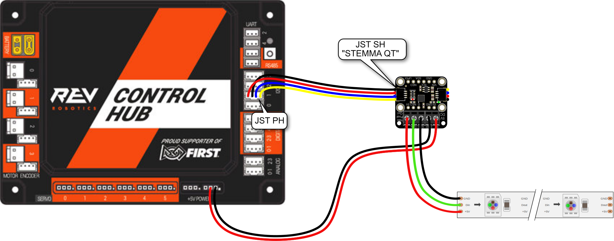
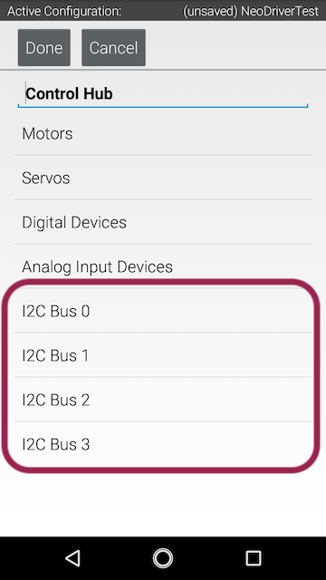
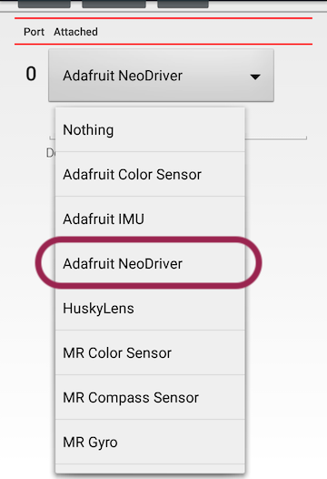
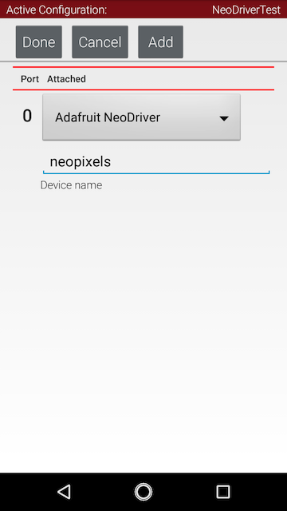

# FTC NeoDriver
This repository contains driver software for use with the [Adafruit NeoDriver - I2C to NeoPixel Driver Board](https://www.adafruit.com/product/5766) in conjunction with the [FIRST Tech Challenge](https://www.firstinspires.org/robotics/ftc) [Control System](https://ftc-docs.firstinspires.org/en/latest/programming_resources/shared/control_system_intro/The-FTC-Control-System.html)

# Wiring up the Hardware

You will need:
* [Rev Robotics Control Hub](https://www.revrobotics.com/rev-31-1595/) (or [Rev Robotics Expansion Hub](https://www.revrobotics.com/rev-31-1153/))
* [Adafruit NeoDriver - I2C to NeoPixel Driver Board](https://www.adafruit.com/product/5766)
* [4-pin JST PH to JST SH Cable](https://www.adafruit.com/product/4424), 
* Connector cable for plugging into a 5V port on the Control Hub
* Strand of NeoPixels (or any LED strings using the WS2812 / SK6812 family)




1. Connect the NeoDriver board to one of the I2C ports on the Control Hub. The NeoDriver needs a JST SH (STEMMA QT) connector and the Control Hub expects a JST PH connector. Make note of which I2C port you plugged it into; you'll need to select the same one in Hardware Config.
2. Connect 5V power from the Control Hub aux ports to the NeoDriver. This is what will provide power to light the NeoPixel strand; the I2C port cannot provide enough current.
3. Connect the NeoPixel strand to the NeoDriver screw terminals, `GND`, `5V`, and `Data`

# Installing the Library

_NOTE: These instructions will change a bit once there is a release of the library_

For the moment, until the library is published to Maven Central add a new repository entry to your `build.dependencies.gradle` file:

```gradle
repositories {
    mavenCentral()
    google() // Needed for androidx
    maven {
        url 'https://s01.oss.sonatype.org/content/repositories/snapshots/'
    }
}
```

Then add a new line to the `dependencies` section in `build.dependencies.gradle`:

```gradle
dependencies {
    implementation 'org.firstinspires.ftc:Inspection:9.0.0'
    implementation 'org.firstinspires.ftc:Blocks:9.0.0'
    implementation 'org.firstinspires.ftc:Tfod:9.0.0'
    implementation 'org.firstinspires.ftc:RobotCore:9.0.0'
    implementation 'org.firstinspires.ftc:RobotServer:9.0.0'
    implementation 'org.firstinspires.ftc:OnBotJava:9.0.0'
    implementation 'org.firstinspires.ftc:Hardware:9.0.0'
    implementation 'org.firstinspires.ftc:FtcCommon:9.0.0'
    implementation 'org.firstinspires.ftc:Vision:9.0.0'
    implementation 'org.firstinspires.ftc:gameAssets-CenterStage:1.0.0'
    implementation 'org.tensorflow:tensorflow-lite-task-vision:0.4.3'
    runtimeOnly 'org.tensorflow:tensorflow-lite:2.12.0'
    implementation 'androidx.appcompat:appcompat:1.2.0'

    implementation 'com.w8wjb.ftc:ftc-neodriver:1.0-SNAPSHOT'
}
```


# Configuring in Hardware Map

> [!IMPORTANT]
> _You will need to download a project containing the library at least once before the Adafruit NeoDriver option will appear in Hardware Config_

1. On a connected Driver Station, [edit the robot configuration file](https://ftc-docs.firstinspires.org/en/latest/hardware_and_software_configuration/configuring/getting_started/getting-started.html)
2. Choose the I2C port that you connected the NeoDriver to 



3. Assuming the driver library has been downloaded, you should now see an option labeled "Adafruit NeoDriver" 



4. Assign a name to the device and exit, saving the config when prompted 




# API Usage

### Initilization

In the initialization section of your OpMode, you will need to retrieve the device from the `hardwareMap` and configure how many pixels exist on your NeoPixel strand

```java
import com.qualcomm.robotcore.eventloop.opmode.Autonomous;
import com.qualcomm.robotcore.eventloop.opmode.OpMode;
import com.w8wjb.ftc.AdafruitNeoDriver;


@Autonomous
public class NeoPixelTest extends OpMode {

    private static final int NUM_PIXELS = 30;

    AdafruitNeoDriver neopixels;

    @Override
    public void init() {

        neopixels = hardwareMap.get(AdafruitNeoDriver.class, "neopixels");
        neopixels.setNumberOfPixels(NUM_PIXELS);

    }

}
```

### Setting NeoPixel colors

Pixel colors can be set individually, using an RGB integer. The Android SDK provides a useful utility class, `android.graphics.Color`, for construcing and manipulating this color data.

```java
int color = Color.rgb(74, 230, 255);
neopixels.setPixelColor(0, color);
```

Pixel colors can also be set individually, using a hex color code:

```java
neopixels.setPixelColor(0, "#4AE61A");
```

If you would like to set a block of pixels, it is possible to use an array:

```java
neopixels.setPixelColors(new int[] {
        Color.rgb(255,0,0),
        Color.rgb(0,255,0),
        Color.rgb(0,0,255)
});
```

When setting pixels in bulk, the first index in the array always corresponds to the first pixel in the strand.

There is also a convenience `fill` method to set the entire strand to one color:

```java
if (gamepad1.a) {
    // Signal purple pixel
    neopixels.fill(Color.rgb(207, 145, 255));
} else if (gamepad1.b) {
    // Signal green pixel
    neopixels.fill(Color.rgb(69, 255, 58));
} else if (gamepad1.x) {
    // Signal yellow pixel
    neopixels.fill(Color.rgb(255, 240, 64));
} else {
    // Lights off
    neopixels.fill(0);
}
```

### Sending Data to the Strand

Once the pixel colors have been set, it is criticl to call `show()` to send the data to the NeoPixel strand:

```java
int color = Color.rgb(74, 230, 255);
neopixels.setPixelColor(0, color);
neopixels.show();
```
